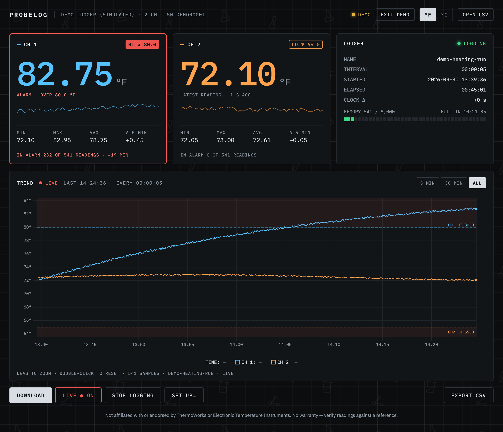

# ProbeLog

Download, chart, set up and watch ThermoWorks ThermaData temperature loggers from your web browser — on Mac, Windows, Linux or ChromeOS. No vendor software, no install.

**[Open ProbeLog](https://thatorjohn.github.io/probelog/)** · **[Try the demo](https://thatorjohn.github.io/probelog/?demo)** (no logger needed)



> Not affiliated with or endorsed by ThermoWorks or Electronic Temperature Instruments. ThermoWorks and ThermaData are trademarks of their respective owners. Independent project, no warranty — check readings against a reference before relying on them.

## Quick start

1. Plug the logger into a USB port.
2. Open **https://thatorjohn.github.io/probelog/** in **Chrome, Edge, Brave or Arc**.
3. Click **Connect logger** and choose it in the browser's list.
4. **Download** to chart everything it has recorded, or **Live** to watch readings arrive.

Next time, the page reconnects on its own.

## Features

- **Download** up to 8,000 readings per probe and chart them — zoom, 5 min / 30 min / all ranges, °F or °C
- **Live view** of new readings as the logger records
- **Alarms** — probes past their limits are flagged in red, the tab title shows the alarm, and each probe shows time spent in alarm
- **Set up** the logger: name, interval, one or two probes, how it starts (now, later, on its button after a delay, or at a date and time) and stops (manually, when full, after N readings, or at a date and time), over/under alarms, and its clock
- **Start / stop** logging from the page
- **Export CSV**, and reopen CSVs later
- **Several loggers** — listed by name and serial, so identical models can be told apart

## Privacy

Everything runs in your browser. Readings go from the logger to the page and nowhere else — there's no server, account or analytics. CSV exports are saved to your computer.

## FAQ

**Why not Safari or Firefox?** They don't support [WebHID](https://developer.mozilla.org/docs/Web/API/WebHID_API), which is how a web page talks to a USB device. You can still open CSV files and try the demo in them.

**The big number says "Last recorded".** The logger only reports its most recent *logged* reading, not what the probe measures right now. When it isn't logging, that value is shown dimmed with the time it was taken.

**Does setting up the logger erase it?** Yes — like the vendor software, saving settings clears the logger's memory. ProbeLog warns you and offers to download first.

**Does it work with my logger?** It's tested with the model below. Other ThermaData loggers may use the same protocol; if you try one, please open an issue either way.

## Tested hardware

- ThermoWorks ThermaData Logger LCD, 2 inputs (product code THS-292-501). Over USB it identifies as "ThermaData™ Logger TCD" (`0483:a07b`).
- General-purpose Type K thermocouple probes (THS-113-444-MC)

## How it works

The USB protocol isn't documented, so it was worked out by recording the vendor software's USB traffic and comparing it with the readings it saved. No vendor software was decompiled or redistributed. Details are in [PROTOCOL.md](PROTOCOL.md).

In short: the logger is a USB HID device. A status report carries its settings, clock and latest readings; a download returns 8-byte records (BCD timestamp + raw value), with `°F = raw / 20 − 500`. Every settings save captured from the vendor software is reproduced byte for byte by the tests.

## Repository layout

| Path | What |
|---|---|
| `web/` | The web app (Vite, TypeScript, Preact, uPlot), including the simulated demo logger |
| `Sources/LoggerKit/` | Swift implementation of the protocol (macOS, IOKit) |
| `Sources/tdlog/` | `tdlog` command-line tool |
| `Tests/LoggerKitTests/` | Captured vendor-software settings writes, shared by the Swift and web tests |
| `PROTOCOL.md` | Protocol notes |

## Development

Web app:

```bash
cd web
npm install
npm run dev      # http://localhost:5173 — add ?demo to use the simulated logger
npm test
npm run build    # static site in web/dist
```

Command-line tool (macOS):

```bash
swift run tdlog status
swift run tdlog download -o log.csv
swift run tdlog            # lists all commands, including setup
```

Pushes to `main` run the tests and deploy the web app to GitHub Pages.

## License

[MIT](LICENSE)
